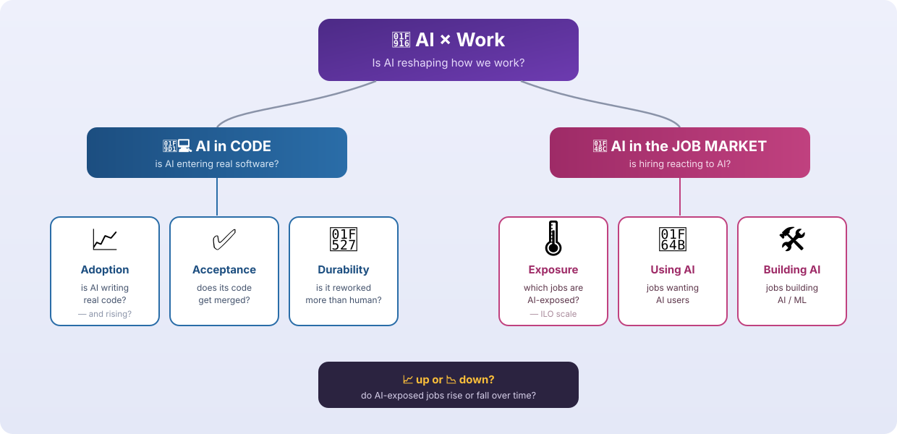
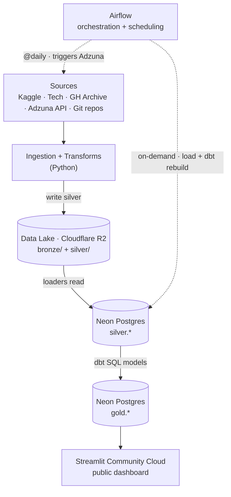
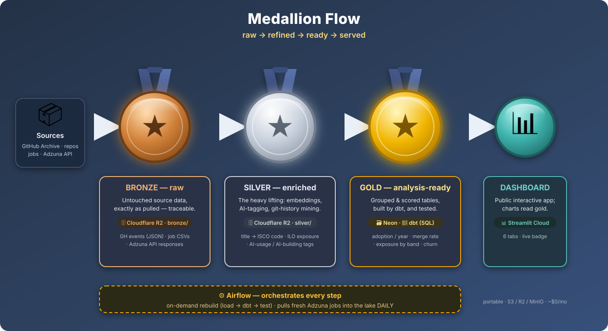
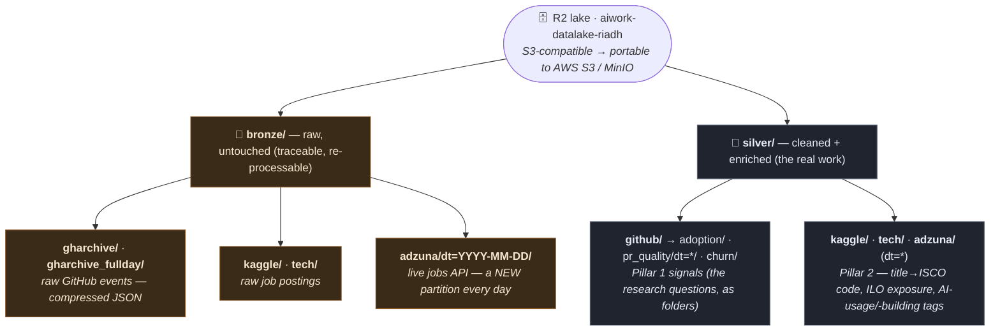
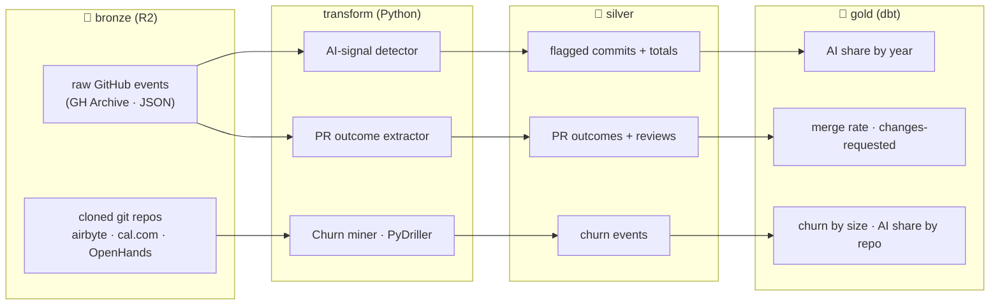
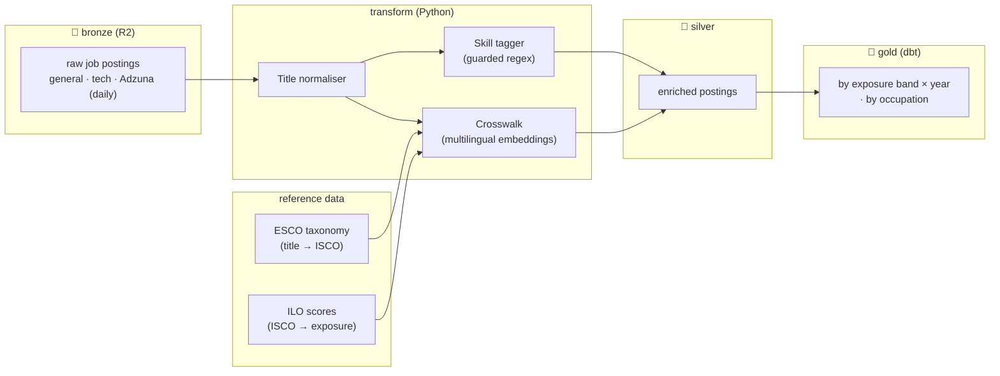
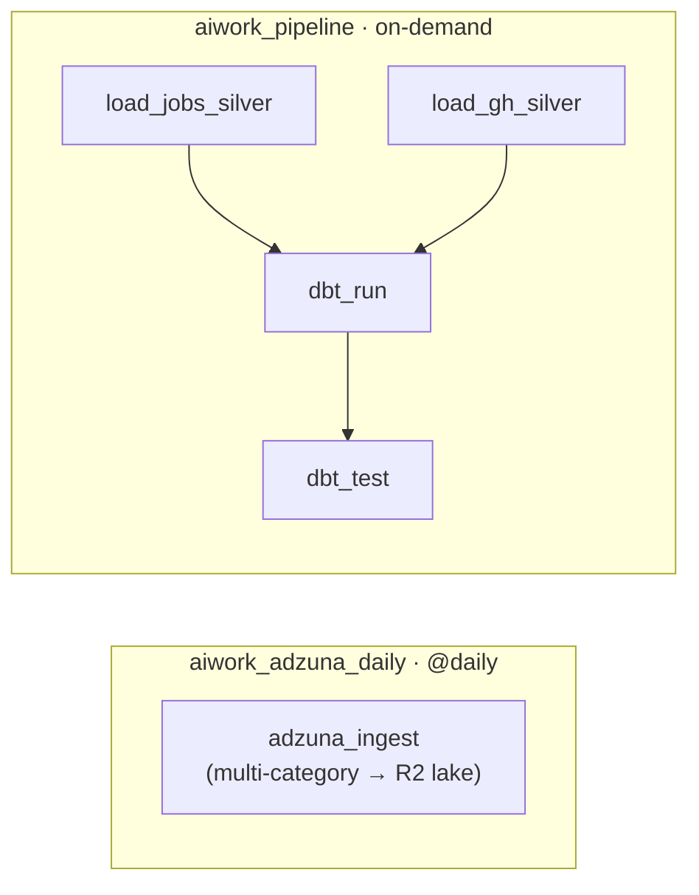

# Pipeline Reference — Cloud Architecture (v4)

**AI × Work** — a two-pillar data pipeline measuring how AI is entering (1) real
codebases and (2) the German job market. This version documents the **cloud
architecture** and adds full **data lineage per pillar**: where every signal
comes from in the lake, how it's transformed and cleaned, and what it looks like
once it lands in gold.

> **One line:** raw sources → **object-storage lake (bronze + silver)** →
> **managed Postgres warehouse (gold, built by dbt)** → **public dashboard**,
> **orchestrated and scheduled by Airflow**.

---

## What aiwork asks

*One question, two pillars — the whole thesis in one picture.*



**In one breath:** *AI is clearly entering code — the question is whether that's good code, and whether the labour market is starting to reward AI skills.* The **ILO** exposure scale ranks jobs by how much AI could touch their tasks; the up/down question asks whether exposed jobs grow or shrink.

---


## Architecture at a glance




## Medallion Flow



**Read it left to right — the whole pipeline in one glance:**

- **📦 Sources** → GitHub Archive events, cloned git repos, job-posting datasets, and the live Adzuna API.
- **🥉 BRONZE — raw.** Source data exactly as pulled, untouched, in R2. Kept **traceable** and **re-processable**. *(GH JSON, job CSVs, Adzuna responses.)*
- **🥈 SILVER — enriched.** The heavy lifting, still in R2: job titles → standard **ISCO codes** (embedding crosswalk), joined to **ILO exposure**, AI-usage/-building tagged; GitHub events parsed; repos mined with PyDriller.
- **🥇 GOLD — analysis-ready.** Grouped, scored tables built by **dbt** in **Neon**, and **tested**. *(adoption/year, merge rate, exposure/band, churn.)*
- **📊 DASHBOARD.** The public Streamlit app reads gold — six tabs plus the live badge.
- **⚙️ Airflow** (dashed ribbon) orchestrates every step and **pulls fresh Adzuna jobs into the lake daily**.

> Colours map to the medals: **bronze** = raw, **silver** = enriched, **gold** = ready. Portable (S3 / R2 / MinIO), ~**$0/month**.

---


## The data lake at a glance

*The medallion isn't a metaphor — it's the folder structure. This mirrors the R2 bucket exactly.*



**Read it in three beats:** (1) two zones — *bronze* raw, *silver* enriched; (2) the `dt=YYYY-MM-DD` partitions mean the lake **grows daily**, it isn't a static snapshot; (3) the `github/` sub-folders **are** the code-pillar research questions — adoption, PR quality, churn. Everything downstream (Neon, gold, the dashboard) is rebuilt from here, and the whole lake is portable across clouds by changing one endpoint.

---

# Data lineage — from raw to chart

*Everything for one signal in one place: **what it starts as** (raw sample) → **what transforms it** (a named feature + technology) → **what it becomes** (silver) → **the gold result** the chart reads. Each sample is labelled with **where that data sits** (lake path, or the Neon table).*

---

## 🧑‍💻 Pillar 1 — AI in code (GitHub)



### ① Adoption — "is AI writing real code?"

🥉 **Starts as** — `gharchive/*.json.gz` — one raw GitHub event per line:
```json
{"type":"PushEvent","repo":{"name":"acme/api"},
 "payload":{"commits":[{"sha":"a1b2c3d",
   "message":"Fix retry logic\n\nCo-authored-by: Copilot <copilot@github.com>"}]},
 "created_at":"2025-04-15T10:22:31Z"}
```
🔧 **Transforms it — “AI-signal detector”** *(Python)*: flags a commit as AI-written from three fingerprints — a **Co-authored-by** an AI tool, a **known agent author**, or a **self-admit** phrase — then **de-duplicates by commit SHA** (the archive replays events). Counts AI commits **and** all commits.

🥈 **Becomes** — `github/adoption/matches.csv` (+ `totals.csv`):

| sha | repo | signal | ai_tool | year |
|---|---|---|---|---|
| a1b2c3d | acme/api | co_authored_by | copilot | 2025 |
| f4e5d6c | acme/web | agent_author | devin | 2025 |
| 9a8b7c6 | beta/cli | self_admit | chatgpt | 2024 |

*(`totals.csv` holds the denominator, e.g. 1,033,392 commits in 2025)*

🔧 **Silver → gold (dbt)**: `GROUP BY year` → `ai_share_pct = sum(matches) / sum(totals)`.

🥇 **Result** — `github_adoption_by_year` (Neon) → **the Adoption chart**:

| year | n_ai_commits | n_commits | ai_share_pct |
|---|---|---|---|
| 2023 | 72 | 1,054,598 | 0.0068 |
| 2024 | 115 | 1,513,819 | 0.0076 |
| 2025 | 1,614 | 1,033,392 | **0.1562** |

*→ ~20× jump. Git-attributable only, so this is a floor.*

---

### ② Acceptance — "does AI's code get merged?"

🥉 **Starts as** — `gharchive_fullday/dt=*/` — raw closed-PR events + review events:
```json
{"type":"PullRequestEvent","action":"closed",
 "payload":{"pull_request":{"merged":true,"additions":40,"deletions":6,
   "user":{"login":"sweep-ai[bot]"}}}}
```
🔧 **Transforms it — “PR outcome extractor”** *(Python)*: one row per closed PR — merged?, size = additions + deletions, hours-open — labelling the author **agent vs baseline**; a second pass reads **review events** and their `state`.

🥈 **Becomes** — `github/pr_quality/dt=*/pr_outcomes.csv` (+ `pr_reviews.csv`):

*pr_outcomes.csv*
| pr | repo | month | author_login | author_class | merged | size_lines | changed_files | hours_open |
|---|---|---|---|---|---|---|---|---|
| 812 | acme/api | 2025-04 | sweep-ai[bot] | ai_agent | true | 46 | 3 | 5.2 |
| 813 | acme/api | 2025-04 | devin-ai | ai_agent | false | 512 | 21 | 30.1 |
| 814 | beta/web | 2025-04 | jdoe | baseline | true | 88 | 6 | 11.4 |

*pr_reviews.csv*
| pr | repo | month | state | pr_author_class |
|---|---|---|---|---|
| 813 | acme/api | 2025-04 | changes_requested | ai_agent |
| 813 | acme/api | 2025-04 | commented | ai_agent |
| 814 | beta/web | 2025-04 | approved | baseline |

🔧 **Silver → gold (dbt)**: `GROUP BY author_class, size_bucket` → merge rate = `avg(merged)`, and change-request rate = `count(state='changes_requested') / count(*)`.

🥇 **Result** — `github_merge_rate`, `github_changes_requested` (Neon) → **the Acceptance charts**:

| size_bucket | author_class | n_prs | merged_rate |
|---|---|---|---|
| 100–500 | ai_agent | 108 | 0.75 |
| 100–500 | baseline | 99,809 | 0.86 |

*→ agents merge a little less at equal size (small agent N — flagged on the chart).*

---

### ③ Durability — "is AI's code reworked more?"

🥉 **Starts as** — **cloned git repos** (not the lake): `airbyte · cal.com · OpenHands` — full commit history, every file changed.

🔧 **Transforms it — “Churn miner”** *(Python + PyDriller)*: walks each repo commit-by-commit and **classifies each commit** —
- **`ai_agent`** → the commit **author login/email matches a known agent or bot** (e.g. `*[bot]`, `sweep-ai`, `devin`, `openhands-agent`);
- **`ai_coauthor`** → a **human** authored it **but** the message carries a `Co-authored-by:` **AI-tool** trailer;
- **`human`** → neither.

Then it computes **14-day follow-up churn**: how much each touched file is rewritten within two weeks.

🥈 **Becomes** — `github/churn/churn_events.csv` (one row per file-touch, all three classes):

| repo | file | author_class | added | deleted | churn_14d |
|---|---|---|---|---|---|
| cal.com | apps/web/app.tsx | ai_agent | 40 | 6 | 12 |
| airbyte | connectors/sync.py | ai_coauthor | 120 | 20 | 74 |
| OpenHands | agenthub/agent.py | human | 30 | 10 | 101 |
| cal.com | packages/ui/button.tsx | ai_agent | 210 | 55 | 84 |

🔧 **Silver → gold (dbt)**: `GROUP BY author_class, size_bucket` → `mean(churn_14d)`; and per repo → `ai_share = ai touches / all touches`.

🥇 **Result** — `github_churn_by_bucket`, `github_ai_share_by_repo` (Neon) → **the Durability chart**:

| size bucket | ai_agent | ai_coauthor | human |
|---|---|---|---|
| 20–100 | 15.7 | 74.0 | 100.9 |
| 100–500 | 84.2 | 126.1 | 166.6 |

*→ within every size band, agent code is rewritten no more than human.*

---

## 💼 Pillar 2 — AI in the job market (German postings)



🥉 **Starts as** — `kaggle/sample_jobs_5000.csv` · `kaggle/job_postings_raw.csv` (tech) · `adzuna/dt=*/de_*.csv` — raw postings:

| id | title | company | category | location |
|---|---|---|---|---|
| 495…21 | Senior Python Developer (m/w/d) | Acme GmbH | IT Jobs | Berlin |
| 495…88 | Data Scientist – NLP | Beta AG | IT Jobs | München |

🔧 **Transform 1 — “Title normaliser”** *(Python)*: strips `(m/w/d)` & gender variants and seniority/wrapper words — **and also** removes **employment-type / contract terms** (`Vollzeit`, `Teilzeit`, `Festanstellung`, `befristet`), **lowercases**, and **normalises umlauts + whitespace/punctuation**.

*example:* `Senior Python Developer (m/w/d) · Vollzeit` → `senior python developer`

🔧 **Transform 2 — “Crosswalk”** *(multilingual-e5 embeddings + ESCO)*: embeds the cleaned title **and every ESCO occupation label**, then takes the nearest by **cosine similarity** — matching **by meaning, not keywords**.

*ESCO reference (`reference/esco_occupations.csv`) — the taxonomy it matches against:*
| esco_label | isco08_4digit |
|---|---|
| software developer | 2512 |
| data scientist | 2511 |
| systems analyst | 2511 |
| financial analyst | 2412 |

*match (cleaned title → nearest ESCO label → ISCO):*
| title_clean | nearest ESCO label | cosine_sim | isco08_4digit |
|---|---|---|---|
| senior python developer | software developer | 0.86 | 2512 |
| data scientist nlp | data scientist | 0.91 | 2511 |

🔧 **Transform 3 — “Exposure join”** *(ISCO → ILO)*: joins that ISCO code to the **ILO** exposure table on `isco08_4digit` (imputes from the 3- then 2-digit parent if a code is missing).

*ILO reference (`reference/ilo_ai_exposure_isco08.csv`) — exposure per occupation:*
| isco08_4digit | occupation_name | exposure_category | mean_task_score |
|---|---|---|---|
| 2512 | Software developers | Gradient 3 | 0.71 |
| 2511 | Systems analysts | Gradient 4 | 0.79 |
| 2412 | Financial analysts | Gradient 2 | 0.48 |

🔧 **Transform 4 — “Skill tagger”** *(guarded regex over a curated skills dictionary)*: scans title + description and sets two flags — **uses AI** (USE anchors: `ChatGPT, Copilot, Claude, LLM…`) vs **builds AI** (BUILD anchors: `machine learning, PyTorch, TensorFlow, MLOps, fine-tuning…`), excluding false friends.

*how a description becomes a flag:*
| description snippet | matched dictionary anchor | flag set |
|---|---|---|
| "…daily use of **ChatGPT** & **Copilot**…" | `chatgpt`, `copilot` → USE | `has_ai_usage = true` |
| "…build & **fine-tune** models in **PyTorch**…" | `pytorch`, `fine-tune`, `machine learning` → BUILD | `has_ai_building = true` |
| "…**prompt** payment terms…" | `prompt` → *excluded (false friend: “punctual”)* | no flag |

🥈 **Becomes** — `kaggle/…` · `tech/…` · `adzuna/dt=*/…` (enriched) → Neon `jobs_kaggle` / `jobs_tech`. **This is where everything is joined onto one posting** — the **ISCO code from the Crosswalk**, the **exposure from the ILO join**, and the **flags from the Skill tagger**:

| title_clean | isco08_4digit | occupation_name | exposure_category | mean_task_score | has_ai_usage | has_ai_building |
|---|---|---|---|---|---|---|
| senior python developer | 2512 | Software developers | Gradient 3 | 0.71 | false | true |
| data scientist nlp | 2511 | Systems analysts | Gradient 4 | 0.79 | true | true |

*→ one row = the raw title, its standard code (ESCO), its exposure score (ILO), and both AI flags (tagger) — all joined together.*

🔧 **Silver → gold (dbt)**: `GROUP BY dataset, exposure_category, year` → `n_postings`, `ai_usage_rate = avg(has_ai_usage)`, `ai_building_rate = avg(has_ai_building)`, `avg_exposure = avg(mean_task_score)`; and a second model groups `BY isco08_4digit` for `jobs_by_occupation`.

🥇 **Result** — `jobs_by_exposure_band_year`, `jobs_by_occupation` (Neon) → **the Jobs charts + exposure snapshot**:

| dataset | exposure_category | year | n_postings | ai_usage_rate | ai_building_rate | avg_exposure |
|---|---|---|---|---|---|---|
| general | Gradient 4 | 2026 | 210 | 0.081 | 0.010 | 0.78 |
| tech | Gradient 4 | 2025 | 180 | — | 0.560 | 0.80 |

*→ AI-usage concentrates in exposed roles; AI-building is a tech phenomenon.*

> Samples show the **shape** of each stage (ids/companies masked); real partitions/tables hold the full data.

## What the cloud lift changed

| Layer | Before (local) | After (cloud) |
|---|---|---|
| **Data lake** | `data/` folders on laptop | **Cloudflare R2** (S3-compatible object storage) |
| **Warehouse** | Docker Postgres on laptop | **Neon** (managed serverless Postgres) |
| **Serving** | `localhost:8501` | **Streamlit Community Cloud** (public URL) |
| **Orchestration** | Airflow, `schedule=None` | Airflow with **daily Adzuna ingestion** |
| **Portability** | hardcoded `data/…` paths | one endpoint setting → Cloudflare R2 / AWS S3 / MinIO, no code change |

**One storage boundary in code** (`src/common/config.py`): `LAKE_ROOT` selects
local vs cloud, `S3_ENDPOINT_URL` selects the provider — so the pipeline runs
unchanged on local disk, AWS S3, Cloudflare R2, or self-hosted MinIO. No lock-in.

---

## Orchestration + scheduling — Airflow (two DAGs)



**`aiwork_adzuna_daily`** (`@daily`) is the live data-collection engine: it pulls
fresh German postings across several categories from the Adzuna API and lands them
in the R2 lake (`bronze/adzuna/dt=<date>/` + enriched `silver/adzuna/dt=<date>/`),
a new dated partition per run. It runs in-container (lightweight keyword crosswalk
+ regex tagger — no embedding model).

**`aiwork_pipeline`** (on-demand) loads both pillars' silver from R2 into Neon,
then `dbt run` + `dbt test` rebuild and validate gold. Heavy silver creation
(embedding crosswalk, GH-Archive parsing, PyDriller mining) runs on the host by
design.

> **Adzuna silver is lake-only** — a different schema from the batch job silver,
> so it accumulates in R2 but isn't loaded into Neon/gold. Its freshness is shown
> in the dashboard's **Architecture** tab (live panel).
>
> Airflow runs locally in Docker; scheduled runs fire while the machine is up. In
> production it would deploy to managed Airflow (MWAA/Composer) — DAGs unchanged.

---

## Dashboard

Six tabs — **Adoption · Jobs · Acceptance · Durability · Synthesis · Architecture**
— reading `gold.*` from Neon (`GOLD_BACKEND=postgres`), each chart annotated with
*What / Why / Honest-limitation*. Highlights:

- **Jobs** opens with an **ILO-style AI-exposure snapshot**: every occupation
  posted in a chosen year, plotted by mean exposure score (x) × task-score
  variability (y), coloured by exposure gradient, bubble-sized by postings — a
  yearly snapshot alongside the trend charts.
- **Architecture** renders this cloud diagram, the stack, per-pillar lineage, and
  a **live Adzuna panel** reading the latest `silver/adzuna` partition from R2.

## The stack at a glance

| Layer | Tool |
|---|---|
| Data lake | **Cloudflare R2** (S3-compatible object storage) |
| Warehouse | **Neon** (managed Postgres — `silver` + `gold`) |
| Transformation | **dbt** (SQL models, both pillars) |
| Governance | **dbt tests** (8 gold models, 5 tests) |
| Orchestration / scheduling | **Airflow** (Docker, daily Adzuna ingestion) |
| Serving | **Streamlit Community Cloud** + Plotly |
| Containerization | **Docker Compose** |
| Portability | `LAKE_ROOT` + `S3_ENDPOINT_URL` (S3 / R2 / MinIO) |

**Cost:** R2 free tier (10 GB, zero egress) + Neon free tier + Streamlit
Community Cloud = **$0/month at this scale.**

---

## Headline findings

**Pillar 1 — AI in code:** AI-signal commit share **0.68 % → 0.76 % → 15.62 %**
(2023→24→25); agent PRs accepted less (size-controlled); AI-touched code churns
**≤** human within every size bucket.

**Pillar 2 — jobs:** AI-**usage** demand is a 2026 phenomenon concentrated in
AI-exposed occupations; AI-**building** demand is a tech phenomenon (~40–57 % of
tech roles); the exposure gradient is clean and monotonic.

**Honest limitations** (on every chart): git-attributable AI only (adoption is a
floor); Adzuna has no salary data and is category-limited; small agent-PR counts;
parallel trends, not fitted correlations.

---

## Glossary (short)
**medallion** (bronze/silver/gold) · **ISCO-08 / ESCO / ILO** (occupation codes,
EU taxonomy, AI-exposure scores) · **crosswalk** (title → code mapping) ·
**embedding** (meaning-vector; here multilingual-e5) · **author_class**
(ai_agent / ai_coauthor / baseline / human) · **follow-up churn** (rework on a
file within 14 days) · **Hive-style `dt=` partition** (date encoded in folder
name). Full silver-internals definitions (crosswalk tiers, exposure imputation)
are in v1.