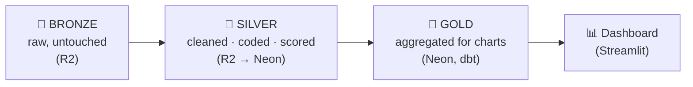
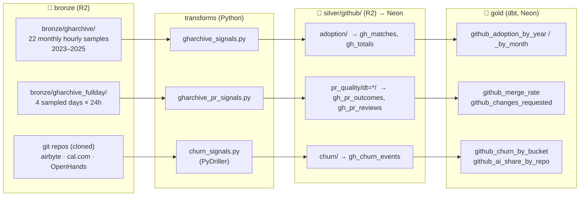
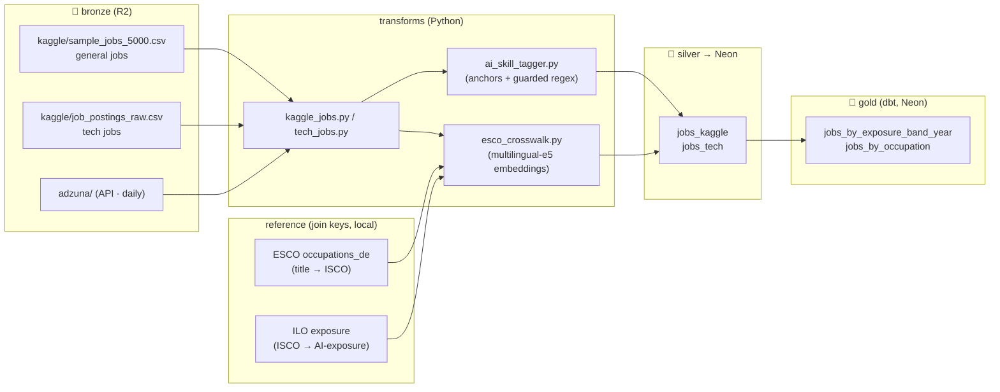
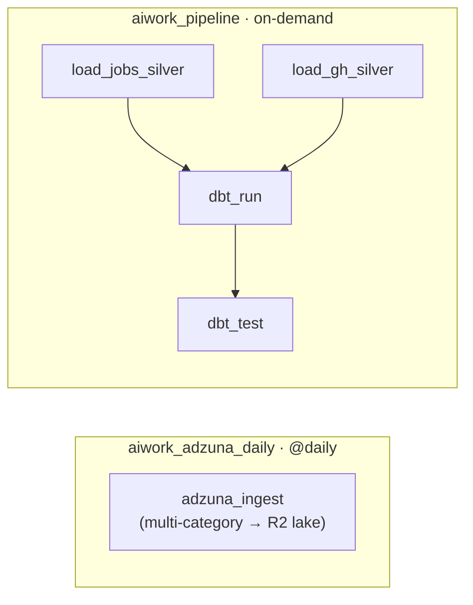

# Pipeline Reference — Cloud Architecture (v4)

**AI × Work** — a two-pillar data pipeline measuring how AI is entering (1) real
codebases and (2) the German job market. This version documents the **cloud
architecture** and adds full **data lineage per pillar**: where every signal
comes from in the lake, how it's transformed and cleaned, and what it looks like
once it lands in gold.

> **One line:** raw sources → **object-storage lake (bronze + silver)** →
> **managed Postgres warehouse (gold, built by dbt)** → **public dashboard**,
> **orchestrated and scheduled by Airflow**.

---

## Architecture at a glance

```mermaid
flowchart TD
    SRC["Sources<br/>Kaggle · Tech · GH Archive · Adzuna API · Git repos"] --> ING["Ingestion + Transforms<br/>(Python)"]
    ING -->|write silver| LAKE[("Data Lake · Cloudflare R2<br/>bronze/ + silver/")]
    LAKE -->|loaders read| SILVER[("Neon Postgres<br/>silver.*")]
    SILVER -->|dbt SQL models| GOLD[("Neon Postgres<br/>gold.*")]
    GOLD --> APP["Streamlit Community Cloud<br/>public dashboard"]
    AIRFLOW["Airflow<br/>orchestration + scheduling"] -.->|@daily · triggers Adzuna| SRC
    AIRFLOW -.->|on-demand · load + dbt rebuild| SILVER
```

## The medallion flow



---

# Data lineage by pillar

Each pillar below traces the same path: **which raw file in the lake → which
signal → how it's extracted & cleaned → the silver table → the gold table → a
sample of the gold output**.

---

## 🧑‍💻 Pillar 1 — AI in code (GitHub)

**Question:** is AI actually entering real codebases, and is the code it produces
accepted and durable?

### Lineage



### Signal by signal

| Signal | Source in lake | Extraction & cleaning | Silver | Gold |
|---|---|---|---|---|
| **Adoption** (AI commit share) | `bronze/gharchive/*.json.gz` — `PushEvent` commits + `PullRequestEvent` | Parse one JSON event per line. Per commit, flag AI-authorship: `Co-authored-by:` trailer naming an AI tool, a known AI-agent actor/author, or a self-admit phrase ("generated with ChatGPT"). **Dedupe replayed commits by SHA.** Count matches **and** total commits (the denominator). | `gh_matches`, `gh_totals` | `github_adoption_by_year`, `_by_month` |
| **Merge rate** (acceptance) | `bronze/gharchive_fullday/` — `PullRequestEvent` (`action=closed`) | One row per closed PR: `merged?`, `size_lines = additions + deletions`, `hours_open`. Label `author_class` = `ai_agent` (autonomous agent) vs `baseline`. Dedupe by (repo, PR#). | `gh_pr_outcomes` | `github_merge_rate` |
| **Changes requested** (review pushback) | `bronze/gharchive_fullday/` — `PullRequestReviewEvent` | One row per review with its `state` (`changes_requested` / `approved` …) and the PR author's class. | `gh_pr_reviews` | `github_changes_requested` |
| **Durability** (follow-up churn) | Git repo history via **PyDriller** | Walk each repo commit-by-commit. Classify commit: `ai_agent` (agent authored), `ai_coauthor` (human + AI trailer), else `human`. One row per (commit, file) with `added`/`deleted`/`churn`. Compute **14-day follow-up churn** = churn on the same file within 14 days, by anyone. | `gh_churn_events` | `github_churn_by_bucket`, `github_ai_share_by_repo` |

### Gold samples

**`github_adoption_by_year`** — the headline: AI-signal commit share by year.

| year | n_ai_commits | n_commits | ai_share_pct |
|---|---|---|---|
| 2023 | 72 | 1,054,598 | 0.0068 |
| 2024 | 115 | 1,513,819 | 0.0076 |
| 2025 | 1,614 | 1,033,392 | **0.1562** |

*→ ~20× jump in 2025. (Git-attributable AI only — silent Copilot leaves no trace, so this is a floor.)*

**`github_churn_by_bucket`** — mean 14-day follow-up churn (lines), by class × PR size. *Lower = more durable.*

| size bucket | ai_agent | ai_coauthor | human |
|---|---|---|---|
| 0–20 | 12.5 | 53.7 | 36.1 |
| 20–100 | 15.7 | 74.0 | 100.9 |
| 100–500 | 84.2 | 126.1 | 166.6 |
| 500+ | 419.3 | 732.1 | 569.8 |

*→ Within every size bucket, `ai_agent` code is rewritten no more than human — it isn't sloppier.*

**`github_ai_share_by_repo`** — AI share of file-touches per repo.

| repo | ai_pct |
|---|---|
| OpenHands | 59.1 |
| cal.com | 53.2 |
| airbyte | 27.1 |

---

## 💼 Pillar 2 — AI in the job market (German postings)

**Question:** is the market asking workers to *use* AI, and *build* AI — and in
which occupations?

### Lineage



### Signal by signal

| Signal | Source in lake | Extraction & cleaning | Silver | Gold |
|---|---|---|---|---|
| **Occupation code** (ISCO-08) | job `title` / `title_clean` + **ESCO** taxonomy | Normalize title (lowercase, strip `(m/w/d)`, gender suffixes, seniority/employment wrapper words). Match by **meaning** via multilingual-e5 embeddings → nearest ESCO label → its ISCO-08 code. **Tiered:** alias → exact → semantic → unmapped, each with a confidence `match_score`. | `jobs_kaggle` / `jobs_tech` (`isco08_4digit`, `match_method`, `match_score`) | `jobs_by_occupation` |
| **AI-exposure** | ISCO code + **ILO** file | Join ISCO → ILO exposure (`exposure_category`, `mean_task_score`). If the code isn't in ILO, **impute** from its 3-digit (then 2-digit) parent average. | `exposure_category`, `exposure_order`, `mean_task_score`, `exposure_imputed` | `jobs_by_exposure_band_year` (`avg_exposure`) |
| **AI-usage demand** (wants people who *use* AI) | job `title` + full `description` | Regex/anchor tagger: named tools (ChatGPT, Copilot, Claude…), gated `KI-Anwendung` (only near a usage verb), LLM tokens. Excludes false friends (`prompt`=pünktlich, `regenerativ`) and recruiter boilerplate. → `has_ai_usage`. | `has_ai_usage` | `jobs_by_exposure_band_year` (`ai_usage_rate`) |
| **AI-building demand** (roles that *build* AI/ML) | `skills_extracted` + `description` | Same tagger, BUILD anchors: machine learning, PyTorch, TensorFlow, MLOps, fine-tuning… → `has_ai_building`. | `has_ai_building` | `jobs_by_exposure_band_year` (`ai_building_rate`) |

### Gold samples

**`jobs_by_exposure_band_year`** — per dataset × exposure band × year *(illustrative rows; real table = 38 rows)*.

| dataset | exposure_category | year | n_postings | ai_usage_rate | ai_building_rate | avg_exposure |
|---|---|---|---|---|---|---|
| general | Gradient 4 (highest) | 2026 | 210 | 0.081 | 0.010 | 0.78 |
| general | Gradient 2 | 2026 | 640 | 0.022 | 0.004 | 0.41 |
| tech | Gradient 4 (highest) | 2025 | 180 | — | 0.560 | 0.80 |

*→ AI-usage demand concentrates in high-exposure roles; AI-building is a tech phenomenon.*

**`jobs_by_occupation`** — occupation-level grain *(illustrative; real table = 549 rows)*.

| isco08_4digit | occupation_name | n_postings | ai_usage_rate | mean_task_score |
|---|---|---|---|---|
| 2512 | Software developers | 430 | 0.061 | 0.79 |
| 3341 | Office supervisors | 120 | 0.015 | 0.52 |

---

## What the cloud lift changed

| Layer | Before (local) | After (cloud) |
|---|---|---|
| **Data lake** | `data/` folders on laptop | **Cloudflare R2** (S3-compatible object storage) |
| **Warehouse** | Docker Postgres on laptop | **Neon** (managed serverless Postgres) |
| **Serving** | `localhost:8501` | **Streamlit Community Cloud** (public URL) |
| **Orchestration** | Airflow, `schedule=None` | Airflow with **daily Adzuna ingestion** |
| **Portability** | hardcoded `data/…` paths | one endpoint setting → Cloudflare R2 / AWS S3 / MinIO, no code change |

**One storage boundary in code** (`src/common/config.py`): `LAKE_ROOT` selects
local vs cloud, `S3_ENDPOINT_URL` selects the provider — so the pipeline runs
unchanged on local disk, AWS S3, Cloudflare R2, or self-hosted MinIO. No lock-in.

---

## Orchestration + scheduling — Airflow (two DAGs)



**`aiwork_adzuna_daily`** (`@daily`) is the live data-collection engine: it pulls
fresh German postings across several categories from the Adzuna API and lands them
in the R2 lake (`bronze/adzuna/dt=<date>/` + enriched `silver/adzuna/dt=<date>/`),
a new dated partition per run. It runs in-container (lightweight keyword crosswalk
+ regex tagger — no embedding model).

**`aiwork_pipeline`** (on-demand) loads both pillars' silver from R2 into Neon,
then `dbt run` + `dbt test` rebuild and validate gold. Heavy silver creation
(embedding crosswalk, GH-Archive parsing, PyDriller mining) runs on the host by
design.

> **Adzuna silver is lake-only** — a different schema from the batch job silver,
> so it accumulates in R2 but isn't loaded into Neon/gold. Its freshness is shown
> in the dashboard's **Architecture** tab (live panel).
>
> Airflow runs locally in Docker; scheduled runs fire while the machine is up. In
> production it would deploy to managed Airflow (MWAA/Composer) — DAGs unchanged.

---

## Dashboard

Six tabs — **Adoption · Jobs · Acceptance · Durability · Synthesis · Architecture**
— reading `gold.*` from Neon (`GOLD_BACKEND=postgres`), each chart annotated with
*What / Why / Honest-limitation*. Highlights:

- **Jobs** opens with an **ILO-style AI-exposure snapshot**: every occupation
  posted in a chosen year, plotted by mean exposure score (x) × task-score
  variability (y), coloured by exposure gradient, bubble-sized by postings — a
  yearly snapshot alongside the trend charts.
- **Architecture** renders this cloud diagram, the stack, per-pillar lineage, and
  a **live Adzuna panel** reading the latest `silver/adzuna` partition from R2.

## The stack at a glance

| Layer | Tool |
|---|---|
| Data lake | **Cloudflare R2** (S3-compatible object storage) |
| Warehouse | **Neon** (managed Postgres — `silver` + `gold`) |
| Transformation | **dbt** (SQL models, both pillars) |
| Governance | **dbt tests** (8 gold models, 5 tests) |
| Orchestration / scheduling | **Airflow** (Docker, daily Adzuna ingestion) |
| Serving | **Streamlit Community Cloud** + Plotly |
| Containerization | **Docker Compose** |
| Portability | `LAKE_ROOT` + `S3_ENDPOINT_URL` (S3 / R2 / MinIO) |

**Cost:** R2 free tier (10 GB, zero egress) + Neon free tier + Streamlit
Community Cloud = **$0/month at this scale.**

---

## Headline findings

**Pillar 1 — AI in code:** AI-signal commit share **0.68 % → 0.76 % → 15.62 %**
(2023→24→25); agent PRs accepted less (size-controlled); AI-touched code churns
**≤** human within every size bucket.

**Pillar 2 — jobs:** AI-**usage** demand is a 2026 phenomenon concentrated in
AI-exposed occupations; AI-**building** demand is a tech phenomenon (~40–57 % of
tech roles); the exposure gradient is clean and monotonic.

**Honest limitations** (on every chart): git-attributable AI only (adoption is a
floor); Adzuna has no salary data and is category-limited; small agent-PR counts;
parallel trends, not fitted correlations.

---

## Glossary (short)
**medallion** (bronze/silver/gold) · **ISCO-08 / ESCO / ILO** (occupation codes,
EU taxonomy, AI-exposure scores) · **crosswalk** (title → code mapping) ·
**embedding** (meaning-vector; here multilingual-e5) · **author_class**
(ai_agent / ai_coauthor / baseline / human) · **follow-up churn** (rework on a
file within 14 days) · **Hive-style `dt=` partition** (date encoded in folder
name). Full silver-internals definitions (crosswalk tiers, exposure imputation)
are in v1.
