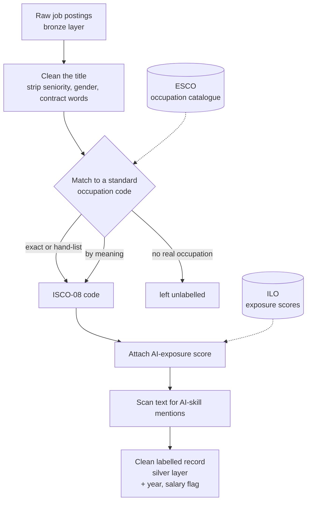

# Capstone — Week 2 Update

**Project:** AI exposure and the German job market
**Week:** 2 · **Prepared for:** coach sync · **Date:** 2026-08-12

The project asks how German jobs are being affected by AI, **depending on how
exposed each occupation is to it** — looked at three ways over time:

1. **Job demand** — are postings for more-exposed occupations growing or
   shrinking?
2. **Skills** — are those jobs increasingly asking for AI skills?
3. **Pay** — how are salaries trending across exposure levels?

The problem is that a raw job posting doesn't carry what's needed to answer any
of these. It has a messy free-text title ("Mitarbeiter Logistik", "Senior Data
Scientist m/w/d") and a description, but no standard label for *what occupation
it is* and no measure of *how exposed that occupation is to AI*. Without those
labels, nothing can be grouped or compared over time.

This week's work was building the machinery that adds those labels to every
posting — occupation, exposure score, year, salary flag, and AI-skill mention —
automatically and reliably. That labelled data is the shared foundation for all
three analyses above. It now runs end to end on both datasets and passes all
data-quality checks. The sections below give the big picture first, then detail
where it's worth it.

---

## 1. Current pipeline flowchart

Every posting travels the same path: it comes in raw, gets cleaned, is matched
to a standard occupation, has an AI-exposure score attached, is scanned for
AI-skill mentions, and is saved as one clean record (carrying its year and
salary flag for the trend analyses). Two public reference datasets feed the
process — **ILO** (the UN labour organisation's study scoring each occupation
for AI exposure) and **ESCO** (the EU's occupation catalogue, which bridges
German titles to standard codes).

**One posting through the whole path (real example):**

| Step | Value |
|---|---|
| Raw title | `Senior Data Scientist (m/w/d)` |
| Cleaned title | `data scientist` — seniority and gender marker removed |
| Occupation code | `2511 — Systems Analysts` |
| AI-exposure score | Gradient 2 · 0.49 out of 1 |
| Asks for AI skills? | Yes — text mentions "machine learning" |

## 2. Progress / deliverables

The pipeline is **working end to end on both datasets**. Concretely, this week
produced:

- **The occupation matcher** (`esco_crosswalk.py`) — turns a messy German title
  into a standard occupation code and attaches its exposure score.
- **Two ingestion scripts** that run the general and tech datasets through it
  into dated output files.
- **The exposure reference table** (all 427 scored occupations from the ILO
  study), and a **quality-check script** that audits every run.

**What one finished record contains** (saved per posting):

| Field | Example | Meaning |
|---|---|---|
| `normalized_title` | `data scientist` | the cleaned title |
| `isco08_4digit` | `2511` | standard occupation code (the join key) |
| `occupation_name` | `Systems Analysts` | that code's name |
| `match_method` | `alias` | how it matched (exact / by-meaning / hand-list) |
| `exposure_category` | `Gradient 2` | AI-exposure band |
| `mean_task_score` | `0.49` | exposure as a number, 0–1 |
| `has_ai_skill` | `True` | does the posting ask for AI skills |
| `has_salary_info` | `True` | whether the posting states pay (for the salary trend) |
| `year` | `2025` | for the over-time trends |

Every record carrying occupation + exposure + year + salary flag + AI-skill is
exactly what lets us later slice **demand, skills, and pay** by exposure band
over time.

## 3. MVP

The minimum viable product for this stage is: *every posting reliably labelled
with an occupation and an exposure score, so the three trends can be measured.*
That's now met. As proof the labelling works, here is the first of the three
cuts — AI-skill demand across exposure levels (the other two, demand volume and
pay, come with the gold layer):

- **Coverage** (share confidently labelled): **93%** of the general dataset
  (the unlabelled 7% are titles with no real occupation, like "volunteer year")
  and **100%** of the tech dataset.

| Exposure band | General: postings / AI% | Tech: postings / AI% | Avg exposure (0–1) |
|---|---|---|---|
| Highest (Gradient 4) | 140 / 0.7% | – | 0.62 |
| Gradient 3 | 247 / 1.2% | 781 / 51.6% | ~0.54 |
| Gradient 2 | 434 / 0.7% | 2,419 / 50.2% | ~0.47 |
| Gradient 1 | 685 / 0.4% | – | 0.37 |
| Minimal | 748 / 0.1% | – | 0.34 |
| Not exposed | 2,306 / 0.2% | – | 0.18 |

Average exposure falls smoothly across the bands, and AI-skill demand
concentrates in the more-exposed ones — the direction we'd expect. The two
datasets play complementary roles: the general one gives the honest spread
across all occupations; the tech one gives the dense AI-skill signal within the
exposed roles.

## 4. Action plan

- **Build the "gold" layer** — the three headline views, each sliced by exposure
  band and year: **(a) job-demand trend** (posting counts over time),
  **(b) AI-skill trend**, and **(c) salary trend**.
- **Grow occupation coverage** from the remaining unlabelled titles.
- **Harden for reliability** — pin data types on occupation codes at every read,
  and keep the null/coverage checks as standing guarantees.

## 5. Challenges / decisions

- **Matching titles reliably was the hard part.** The first approach matched by
  word-overlap and made systematic errors (every "Mitarbeiter…" title landed on
  the same wrong occupation). The fix was to match by **meaning** — comparing
  each title against the occupation catalogue with language-AI — which resolved
  that whole class of error. Example of the difference:

  | Raw title | Word-overlap (old) | By meaning (now) |
  |---|---|---|
  | `Mitarbeiter Logistik` | Medical Sales rep (wrong) | Warehouse/logistics (right) |
  | `freiwilliges soziales jahr` | forced to some occupation | left unlabelled (right) |

- **Honest gaps over confident errors.** The acceptance cut-off was set by
  inspecting real matches and stopping where they stop being correct — a smaller
  correct set beats a larger contaminated one.
- **Modern AI roles have no official code.** The occupation system dates to 2008,
  so "data scientist" and "ML engineer" are assigned by hand to the nearest code.
  This is a documented, adjustable choice — and worth flagging, because the tech
  dataset leans heavily on it (~two-thirds of its rows).
- **Signal strength differs by analysis.** AI-skill mentions are dense in the
  tech data but sparse in the general data (18 postings), so general-dataset AI
  rates show a *direction*, not firm statistics. For the **salary** trend, how
  deep we can go depends on the source — some postings give pay figures, others
  only a salary-present flag; that will shape whether we report pay *levels* or
  just disclosure rates.
